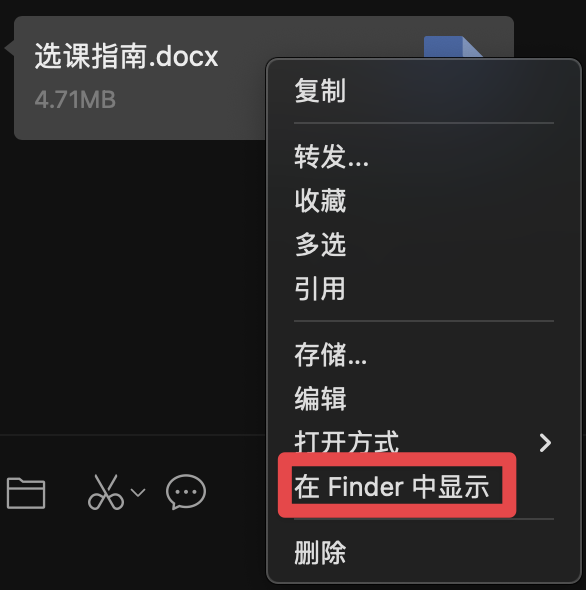
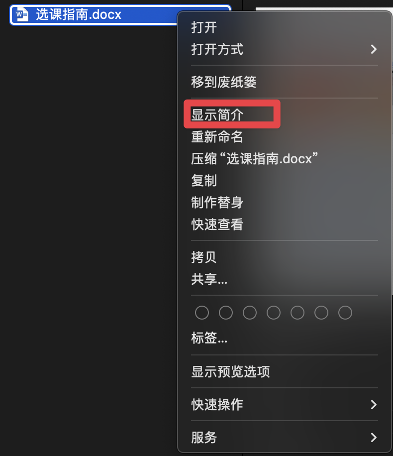
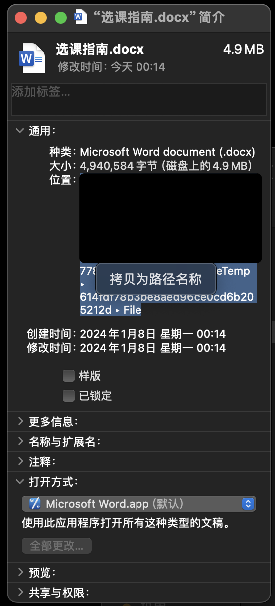

# fuckWeChat

自动移动微信聊天文件到指定目录（仅限mac）。

鉴于微信的sm文件管理，特此写了这个脚本，帮助大家实现自动清理微信下载的聊天文件。

此方法需要homebrew、fswatch、合适的文本编辑器。

## 获取聊天文件路径的方法

### 第一步

右击任意对方发过来的文件，选择“在Finder中显示"



### 第二步

选择文件，右击并选择显示简介



### 第三步

在通用>位置中右击，选择拷贝为路径名称



### 第四步

编辑复制下来的内容

```console
/Users/（你的用户名）/Library/Containers/com.tencent.xinWeChat/Data/Library/Application Support/com.tencent.xinWeChat/2.0b4.0.9/a04c27f1027b84a058sa7ff33f78785/Message/MessageTemp/614fdf78b3be8aed96ce0cd6b205212d/File
```

将 `MessageTemp`后面的内容删去，得到一个类似这个的样子：

```console
/Users/（你的用户名）/Library/Containers/com.tencent.xinWeChat/Data/Library/Application Support/com.tencent.xinWeChat/2.0b4.0.9/a04c27f1027b84a058sa7ff33f78785/Message/MessageTemp
```

## 获取fswatch

此方法需要使用fswatch来监控文件。下面给出homebrew安装fswatch的命令。

```console
brew install fswatch
```

## 编辑脚本内容

你可以自定义你想放到的目录，我这里是放到了我的下载文件夹中。这里我把我的脚本命名为 `fuckWechat.sh`，这个可以根据喜好自定义（记得把所有的都要改）。

```bash
#!/bin/bash

# 目标监控目录
# 这个目录就是你刚刚得到的目录，把它放到双引号之间
WATCHED_DIR="path/to/your/MessageTemp"

# 文件被移动到的目录
# 你可以自定义你想放到的目录，我这里是放到了我的下载文件夹中。
DESTINATION_DIR="~/Downloads"

# 开始递归监控目录
fswatch -o "$WATCHED_DIR" | while read f; do
  # 查找所有名为File的目录，并对其中的每个文件执行操作
  find "$WATCHED_DIR" -type d -name "File" | while read file_dir; do
    for entry in "$file_dir"/*
    do
      if [ -f "$entry" ]; then # 确保它是一个文件
        echo "Detected new file $entry, moving to $DESTINATION_DIR"
        mv "$entry" "$DESTINATION_DIR" # 移动文件
      fi
    done
  done
done
```

## 给脚本赋予权限执行

**切换到脚本所在的目录**，执行

```console
chmod +x fuckWechat.sh
```

使用以下命令检测是否可以运行

```console
./fuckWechat.sh
```

## 将这个脚本添加到开机自动项中

新建一个 `.plist`文件（名字可以自定义），向其中添加以下内容

其中 `Label`的内容可以随意取，`ProgramArguments `需要你存放 `fuckWechat.sh`文件的路径。

```xml
<?xml version="1.0" encoding="UTF-8"?>
<!DOCTYPE plist PUBLIC "-//Apple//DTD PLIST 1.0//EN" "http://www.apple.com/DTDs/PropertyList-1.0.dtd">
<plist version="1.0">
<dict>
    <key>Label</key>
    <string>com.user.fuckWechat</string>

    <key>ProgramArguments</key>
    <array>
        <string>/path/to/your/fuckWechat.sh</string>
    </array>

    <key>RunAtLoad</key>
    <true/>

    <key>KeepAlive</key>
    <false/>

    <key>StandardOutPath</key>
    <string>/tmp/filewatcher.out</string>

    <key>StandardErrorPath</key>
    <string>/tmp/filewatcher.err</string>
</dict>
</plist>

```

将这个  `.plist `文件放到 `/Users/jordan_qd/Library/LaunchAgents`文件夹中。如果通知中心提醒你有一个新启动项(fuckWechat.sh)	，那么启动项应该设置成功了。
